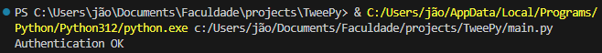
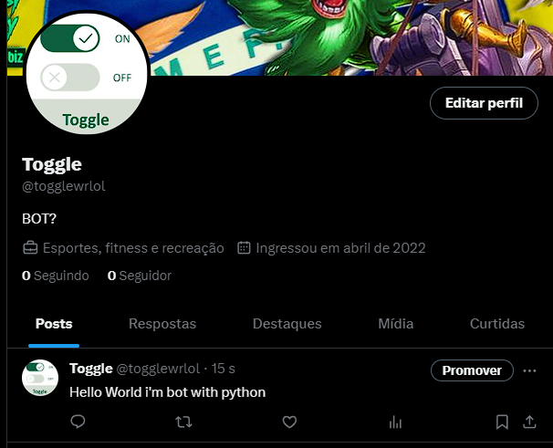

# TWITTER BOT FOR STUDIES PYTHON

### This is a simple example of how the [TWEEPY](https://www.tweepy.org/) Library works, which is used to make Twitter bots in Python

##### The library has other features such as sending messages, like, retweet, dm messages, etc.

### code shown in CLI

### tweet published
